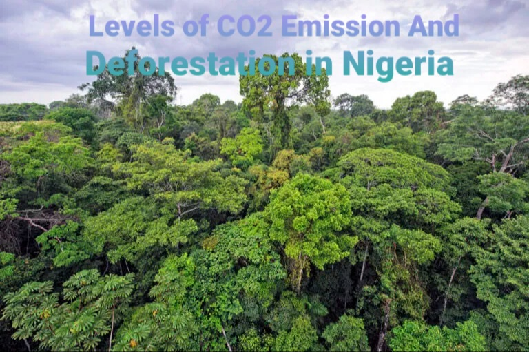
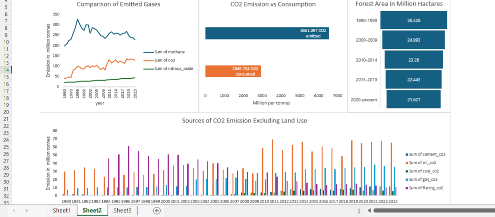

Description:
  I collected this job from a client who consulted me to help out give some data driven insight on the levels of CO2 emission and deforestation in Nigeria. No data was given, I had to source for data myself so I downloaded needed data from faostat (global forest resource assessment) and github.com/owid/co2 (the world in data CO2 emission).

Statement of Problem:
1. What is the amount of CO2 emitted compared to its consumption?
2. Which source of CO2 gases are emitted most over the years?
3. What is the area of forest in Nigeria over the years?

Results Presentation:
  Between 1990 and 2023, CO2 was the second most emitted gas into the atmosphere in Nigeria, after methane.During this period, CO2 emissions from crude oil were higher between 1990 and 1993. However between 1994 to 2006 gas flaring became more dominant source of CO2 emission but between 2007 to 2023, crude oil once again became the major source of CO2 emission followed by CO2 emission from gas. Over the years, Nigeria CO2 emission (6561 million tonnes) have exceeded its consumption (2949 million tonnes). Furthermore the country forest area has decreased from 26,526,000 hectares in 1990 to 21, 627,000 hectares by 2020.

Discussion:
  The higher methane emission than CO2 in Nigeria atmosphere is not a surprise thing because Nigeria produces lot of organic waste from her large human population and agricultural waste which are always left untreated in landfills that scattered across the country and also from gas flaring. 
CO2 was the second among the emitted gases over the years and the major source of CO2 in Nigeria is from the burning of fossil fuels (majorly from crude oil).The higher emission of CO2 than its consumption together with decreasing forest area as a result of poor land use practices had led to higher levels of CO2 in Nigeria atmosphere; the forest if available would have played a crucial role in absorbing more CO2 thereby preventing air pollution, climate change and increasing plant and animal biodiversity in the country but this was not the case.

Recommendation:
  There is need for the Nigerian government to embrace use of renewable energy in order to reduce her over dependence on fossil fuel. Likewise, policies should be put in place to ensure forest conservation through reforestation.
